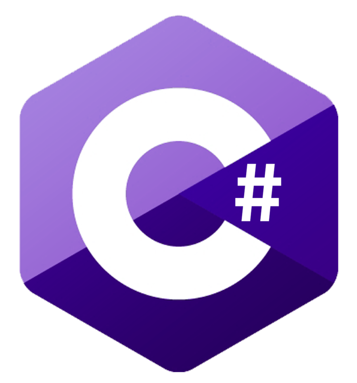

## Muhammad Rohadi here 👋

---

Hi, i'm Adi. I am a motivated and passionate full-stack developer whose graduated from mechanical engineering major. Coding and making cool stuffs are things that I enjoy the most. I am skilled person in handling multiple tasks from back-end coding task to front-end design with a fast-learning, multi-tasking and strong management personality

### What i am learning/working on 🌱

I just focus on learning asp.net core and node js for back-end, and angular and react for front-end.

     
     
     
     
     

### Feel free to reach me out 😄

     
     
     

⚡ Fun fact about me though, i always learning! 🤔
